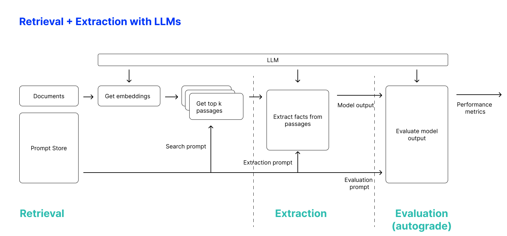

# autograde

Lightweight framework to evaluate LLM using model scoring methods



---

## Features

### Task-oriented

Tasks give you flexibility to test your custom flows.**** 

```py
from autograde.tasks.base import Task

class MyTask(Task):
    '''Task classes override two simple methods
    '''
    def get_input():
        # logic to inputs 

    def test_output():
        # logic to evaluate model outputs
```


### Decoupled sampling from scoring 

autograde is focused on using models to score outputs. The model used for sampling and evaluating can be different so you can use a bigger model at sampling and smaller for evals. 

## Quickstart 

For a quick demo, install requirements:

```sh
$ pip install -r requirements.txt
```

And simply run:

```
$ python run.py \
    --task population_span_extraction \
    --model gpt-4
    --task_file_path sample.jsonl \
    --method_generate sample \
    --temperature 0.5 \
    --task_start_idx 0 \
    --task_end_idx 1

Here's the output to the task, which is extracting demographics from a medical abstract and evaluating against an expert's answer.

================
Model Completion
================

['The abstract defines the Population Demographics as patients with a baseline IOP > or = 24 mm Hg, who were randomized to either the 2% dorzolamide/0.5% timolol combination eye drops twice daily (n = 273) or 0.005% latanoprost eye drops once daily (n = 271). A total of 259 patients in the dorzolamide/timolol group and 268 patients in the latanoprost group were included in the efficacy analysis. These patients had ocular hypertension or glaucoma.'] 

=================
Model Grade Ouput
=================
(A) The submitted answer is a subset of the expert answer and is fully consistent with it. 

====
Eval 
====
[{'rs': ['A'], 'metric': 1}] 
